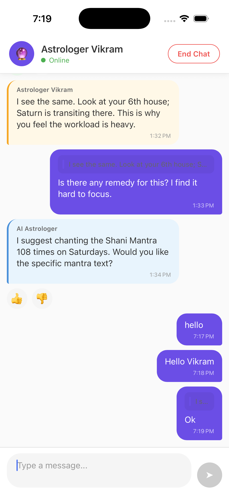

# MyNakshChat - Interactive Astrology Chat

A premium astrology chat application built with React Native (New Architecture), featuring advanced micro-interactions for AI-driven and human-led astrological sessions.

## Screenshot

<p align="center">
  
</p>

## Features

### Part A: Interactive Message Actions

1. **Swipe-to-Reply**
   - Swipe any message bubble to the right to reveal a reply icon
   - Spring animation brings the message back to its original position
   - "Replying to..." preview UI appears above the message input
   - Cancel button clears the reply state
   - **Tap on reply preview** to scroll to and highlight the original message

2. **Message Reactions (Long-Press)**
   - Long-press any message to show a horizontal emoji reaction bar
   - WhatsApp-like emoji selection (🙏 ✨ 🌙 ❤️ 👍 😊)
   - Selected emoji attaches below the message bubble
   - Smooth animations for showing/hiding the reaction bar

### Part B: AI Feedback & Session Flow

1. **AI Dislike Feedback**
   - Like/Dislike toggle for AI Astrologer messages
   - Animated expansion of feedback chips when Dislike is selected:
     - Inaccurate
     - Too Vague
     - Too Long
   - Local state management for feedback selection

2. **Session Termination & Rating**
   - "End Chat" button in the header
   - Full-screen blurred overlay with:
     - 5-star rating component
     - "Thank You" message
   - Layout animations for smooth transitions
   - Alert confirmation for rating data capture

## Steps to Run the App

### Prerequisites
- Node.js >= 20
- React Native development environment set up
- Xcode (for iOS) or Android Studio (for Android)

### Installation

```bash
# Clone the repository
git clone <repository-url>
cd MyNakshChat

# Install dependencies
npm install

# For iOS, install CocoaPods
cd ios && bundle install && bundle exec pod install && cd ..
```

### Running the App

```bash
# Start Metro bundler
npm start

# Run on iOS
npm run ios

# Run on Android
npm run android
```

## Technical Implementation

### How Reanimated 3 Was Used

1. **Shared Values (`useSharedValue`)**
   - `translateX` for tracking swipe gesture position
   - `reactionBarOpacity` and `reactionBarScale` for smooth reaction bar animations
   - `chipsExpanded` for AI feedback chip expansion

2. **Worklets and UI Thread Execution**
   - All gesture callbacks (`onUpdate`, `onEnd`) run on the UI thread via worklets
   - `runOnJS` bridges UI thread to JS thread for state updates (e.g., setting reply state)
   - Prevents JS bridge bottlenecks for 60fps animations

3. **Animated Styles (`useAnimatedStyle`)**
   - Interpolation for reply icon opacity and scale based on swipe distance
   - Spring configurations for natural, physics-based animations
   - Layout animations (`Layout.springify()`) for container size changes

4. **Layout Animations**
   - `FadeIn`, `FadeOut` for entering/exiting components
   - `SlideInDown`, `SlideOutDown` for rating overlay
   - Custom spring configurations for feedback chips

### Gesture Handling Approach

1. **Pan Gesture for Swipe-to-Reply**
   ```typescript
   const panGesture = Gesture.Pan()
     .activeOffsetX(10)        // Only activate after 10px horizontal movement
     .failOffsetY([-10, 10])   // Fail if vertical movement detected (allows scrolling)
     .onUpdate((event) => {
       // Clamp translateX to prevent over-swiping
       translateX.value = Math.min(event.translationX, SWIPE_THRESHOLD + 20);
     })
     .onEnd(() => {
       // Check if threshold reached, then spring back
       if (translateX.value >= SWIPE_THRESHOLD) {
         runOnJS(handleReply)();
       }
       translateX.value = withSpring(0, { damping: 15, stiffness: 150 });
     });
   ```

2. **Long Press for Reactions**
   - Using `Pressable` with `onLongPress` callback
   - Shared values control reaction bar visibility with spring animations

3. **Gesture Composition**
   - `GestureHandlerRootView` wraps the entire app
   - `GestureDetector` wraps swipeable message bubbles
   - Gestures configured to not conflict with `FlatList` scrolling

### State Management Choice: Zustand

**Why Zustand:**

1. **Minimal Boilerplate**: No providers or context wrappers needed - just import and use
2. **Performance**: Automatic shallow comparison prevents unnecessary re-renders. Components only re-render when their subscribed state changes
3. **Selector Pattern**: Fine-grained subscriptions via selectors (e.g., `useChatStore((state) => state.messages)`)
4. **Type Safety**: Full TypeScript integration with inferred types
5. **DevTools Support**: Easy integration with Redux DevTools for debugging
6. **No Provider Hell**: Unlike Context, no need to wrap components in providers

**Store Implementation:**
```typescript
// src/store/useChatStore.ts
import { create } from 'zustand';

interface ChatState {
  messages: Message[];
  replyingTo: Message | null;

  // Actions
  setReplyingTo: (message: Message | null) => void;
  addReaction: (messageId: string, emoji: string) => void;
  removeReaction: (messageId: string, emoji: string) => void;
  setFeedback: (messageId: string, feedbackType: FeedbackType) => void;
  setDislikeReasons: (messageId: string, reasons: DislikeFeedbackReason[]) => void;
  sendMessage: (text: string) => void;
}

export const useChatStore = create<ChatState>((set, get) => ({
  messages: mockMessages,
  replyingTo: null,

  setReplyingTo: (message) => set({ replyingTo: message }),

  addReaction: (messageId, emoji) =>
    set((state) => ({
      messages: state.messages.map((msg) =>
        msg.id === messageId
          ? { ...msg, reactions: [...(msg.reactions || []), emoji] }
          : msg
      ),
    })),
  // ... other actions
}));
```

**Usage in Components:**
```typescript
// Subscribing to specific state slices for optimal re-renders
const messages = useChatStore((state) => state.messages);
const setReplyingTo = useChatStore((state) => state.setReplyingTo);
```

## Performance Trade-offs

### UI Thread vs JS Thread

| Operation | Thread | Reason |
|-----------|--------|--------|
| Gesture tracking | UI | 60fps responsiveness |
| Spring animations | UI | Smooth physics-based motion |
| State updates | JS | React state management |
| Layout changes | UI | Prevents layout thrashing |

### Decisions Made

1. **Worklets on UI Thread**: All animation logic runs on UI thread to prevent JS bridge delays
2. **`runOnJS` for State**: State updates bridged to JS thread only when gesture completes
3. **Memoization**: `useCallback` and `useMemo` prevent unnecessary re-renders in FlatList
4. **Layout Animations**: Using Reanimated's `Layout` modifier instead of JS-driven animations

## Project Structure

```
src/
├── components/
│   ├── MessageBubble.tsx   # Main message component with gestures
│   ├── ReactionBar.tsx     # Emoji reaction selector
│   ├── AIFeedback.tsx      # Like/Dislike with feedback chips
│   ├── ChatInput.tsx       # Message input with reply preview
│   ├── ChatHeader.tsx      # Header with End Chat button
│   ├── RatingOverlay.tsx   # Session end rating modal
│   └── index.ts            # Barrel exports
├── store/
│   └── useChatStore.ts     # Zustand store for chat state
├── data/
│   └── mockMessages.ts     # Initial chat data
├── screens/
│   └── ChatScreen.tsx      # Main chat screen
└── types/
    └── index.ts            # TypeScript definitions
```

## Dependencies

- **react-native**: 0.83.1 (New Architecture)
- **react-native-reanimated**: 4.2.1 (Animations)
- **react-native-gesture-handler**: 2.30.0 (Gestures)
- **react-native-worklets**: 0.7.1 (Worklets for Reanimated)
- **react-native-safe-area-context**: 5.6.2 (Safe area handling)
- **@react-native-community/blur**: 4.4.1 (Blur effects)
- **zustand**: 5.x (State management)

## License

MIT
# ai_chat
